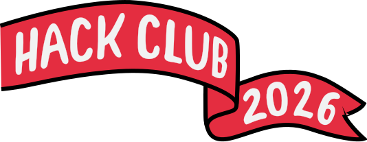

<p align="center">
  
</p>

<h1 align="center">Receipt!</h1>

<p align="center">
  Write a sketch that draws itself.<br />
  We print it on a little thermal machine and post it to you.
</p>

<p align="center">
  <strong>Closes Friday, September 25, 2026 00:00 EDT (UTC&minus;04:00).</strong>
</p>

---

## What this is

You write a small generative-art sketch in p5.js. It renders to a 384 px-wide
black-and-white image. Submit it, and a real receipt gets printed and mailed to you. Maybe with
stickers ;&#x29;

## Make one (made for Windows to add extra minutes to Hackatime)

**1. Fork this repo** and clone your fork. Everything you need is in
[`editor/`](./editor/). (The contest is ending, so there's no point in forking the repo anymore except to learn coding and p5.js in general.)

```powershell
git clone git@github.com:46009361/receipt.git # changed due to internal workflow
cd receipt/editor
npm.cmd install # Smart App Control restricts the execution policy for npm.ps1
npm.cmd run dev
```

**2. Open the local URL** Usually, it is http://localhost:5173/

**3. Edit [`editor/sketch.js`](./editor/sketch.js)** in your normal code editor
and save. The preview redraws on every save. Two things matter:

```js
export const receipt = {
  height: 2000, // 240–2000 px. Width is fixed at 384 by the printer.
  seed: 67, // editor's note: do we really need a comma there?
};

export function drawReceipt(p) {
  // your art goes here — p is a p5 instance
}
```

Draw with any [p5.js function](https://p5js.org/reference/) inside
`drawReceipt(p)`: `p.line()`, `p.rect()`, `p.text()`, `p.random()`, `p.noise()`,
and so on. The starter sketch is there to be deleted — `rm -rf` its contents and
see what you come up with.

**4. Pick a seed** with the seed box or the ↻ button. `p.random()` and
`p.noise()` are both seeded, so the same number always gives the same image.
When the status says **Ready to print**, hit **Export PNG**.

**5. Ship it.** Head to [receipt.hackclub.com/submit](https://receipt.hackclub.com/submit),
sign in with your Hack Club account and submit it. The process should be straightforward. *Make sure to `git push` your fork, too!*

**6. In your terminal**, press `q` and enter to stop your computer from deploying `localhost:5173` in the background. (I'm on Vite, in case `dev` isn't the same for everyone<!--; I wonder if it functions like the `edit` command -->.)

---

<p align="center">
  Run by <a href="https://cskartikey.dev/">@cskartikey</a> · made with ♥ by teenagers, for teenagers at
  <a href="https://hackclub.com/">Hack Club</a>
</p>
